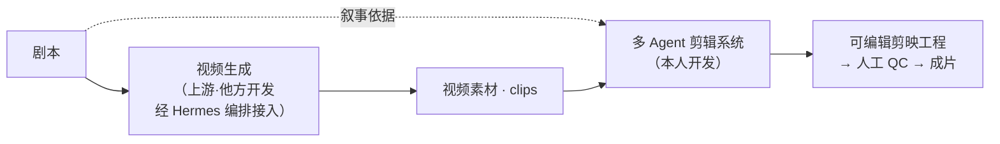
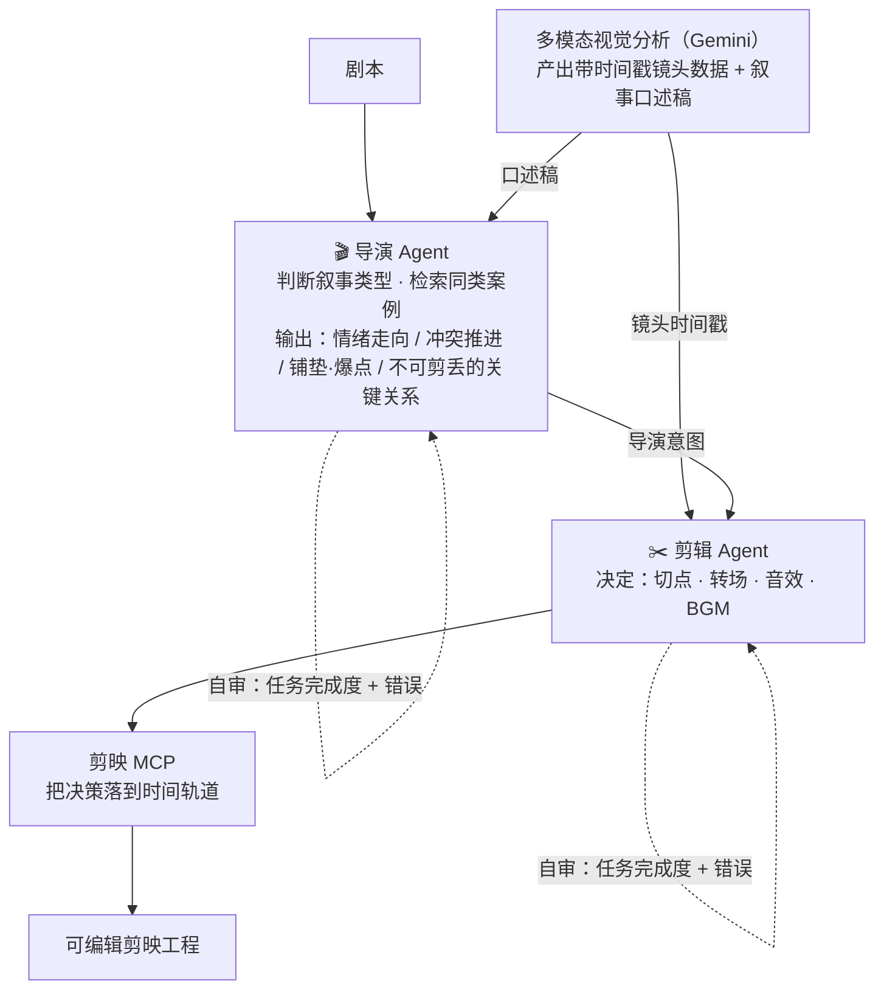

# 短剧 AI 剪辑 · 多 Agent 协作系统（作品展示）

> 模拟真实剧组「导演—剪辑—音效」分工，让多个 Agent 协作把视频素材自动剪成**可编辑的剪映工程**，交人工做最后 QC；并用 Hermes 编排层把「视频生成 → 自动剪辑」串成从剧本到成片的端到端生产线。

**Demo（85 秒成片，由系统自动生成剪映工程后导出）**

> ▶ 点击上方封面播放（1080p，浏览器直接播）；或打开直链：<https://aishinei2024.oss-cn-beijing.aliyuncs.com/resume_demo/short-drama-multi-agent-editing-demo-01.mp4>

> ⚠️ 本页为**脱敏作品展示**：只讲架构与设计思路，不含合作项目的专有代码、剧本与业务数据。**剪辑系统与 Hermes 编排为本人开发；上游「视频生成」由他方完成，本人通过 Hermes 编排接入，不在本人贡献范围内。**

---

## 一、要解决的问题

短剧要 AI 批量出片，「生成一堆 clips」不难；**难的是把 clips 剪成能看的成片**——

- 剪辑质量是**主观**的（哪里切、怎么接、情绪怎么走），难以规模化；
- 让大模型直接剪，容易**幻觉、漏关键信息、翻车**；
- 批量生产要**稳定、风格一致**，不能每集都靠人盯。

目标：把这套「主观、易错、难规模化」的剪辑经验，做成**可拆解、能自纠、可批量**的 Agent 系统。

---

## 二、系统总览

**Hermes 编排层**贯穿全程：调度「剧本 → 生成 → 剪辑 → 成片」，做任务派发、进度对账、断点续跑与限额降级续跑（同为本人开发）。

---

## 三、多 Agent 架构（剧组分工）

把真实剧组的角色分工映射成 Agent 分工，**逐级把"看到的视频"翻译成"剪辑动作"**：

| Agent | 输入 | 职责 |
|-------|------|------|
| **导演** | 剧本 + 视觉口述稿 | 判断这一集的叙事类型，检索同类叙事案例，产出**导演意图**：主打情绪、冲突怎么推进、哪里铺垫、哪里爆点、哪些人物关系/关键信息不能剪丢 |
| **剪辑** | 导演意图 + 镜头时间戳 | 把抽象意图落成**具体剪辑决策**：哪里切、怎么接、音效多密、BGM 什么情绪 |
| **剪映 MCP** | 剪辑决策 | 把决策写到剪映时间轨道，产出可编辑工程 |

---

## 四、关键设计

### 1. 逐级「意图 → 决策」翻译
不让一个模型一步到位从视频跳到成片，而是**分级降解**：视觉理解 → 叙事意图 → 剪辑决策 → 工程落地。每一级只做一件事，可控、可审、可回溯。

### 2. 上下文工程：按角色只喂所需
- 导演读**叙事口述稿**（不读帧级时间戳，避免被细节淹没）；
- 剪辑读**镜头事件时间戳**（用于精确卡点定位）。

分角色注入上下文，**降低单 Agent 负载、抑制幻觉**。

### 3. 音频检索攻坚（本项目最硬的工程点）
音效/BGM 的自动选取有两个真实痛点，解法如下：

**痛点 A：音效选不准。** 用大模型逐条听辨音效太慢，改用 **CLAP（文本—音频对比模型）** 做检索。但 CLAP 只理解音效的**物理形态**、不理解**情感**，直接选出来不可用：
- 针对短剧音效场景**微调 CLAP**（提升有限）；
- 叠加**扩大召回 + rerank 二次校验**，在更大候选池里重排，显著提升选准率。

**痛点 B：音效放不准。** 加音效的位置大致四类：镜头推拉摇移、场景转换、角色情绪变化、动作打击点。其中**运镜与场景切换是 Gemini 能"看到"的**——在这两类位置打**时间戳锚点**作为可加音效点，再由剪辑 Agent 按导演意图决定各锚点的**音效密度**。

> 思路：**认清模型能力边界**（CLAP 不懂情感、大模型听不过来），用**微调 + 检索重排 + 可见信号锚点**在工程上兜住，而不是硬要模型做它做不好的事。

### 4. 质量自审 + 门禁
导演、剪辑各自带**自审**，只查两件事：①任务有没有完成 ②有没有犯错。审核发现的问题回流到对应环节重做，保障批量出片的稳定与风格一致。

---

## 五、技术栈

| 环节 | 用到 |
|------|------|
| 视频理解 | Gemini 多模态视觉分析（带时间戳镜头数据 + 口述稿） |
| 音频选取 | CLAP 文本—音频检索（微调 + 扩召回 + rerank） |
| 工程落地 | 剪映（JianyingPro）MCP |
| Agent / 编排 | 多 Agent 协作 + Skill 封装；Hermes 编排层做跨环节调度与断点续跑 |
| 其它 | Python 自动化脚本、质量门禁 |

---

## 六、成果

- 产出**可直接编辑**的剪映工程，人工只需最后 QC；
- 单集剪辑方案与工程搭建从**小时级压缩到分钟级**；
- 经验沉淀为**可复用 Skill 与质量门禁**，支撑批量出片的效率与风格一致性。
